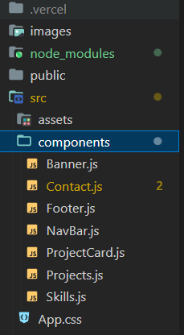
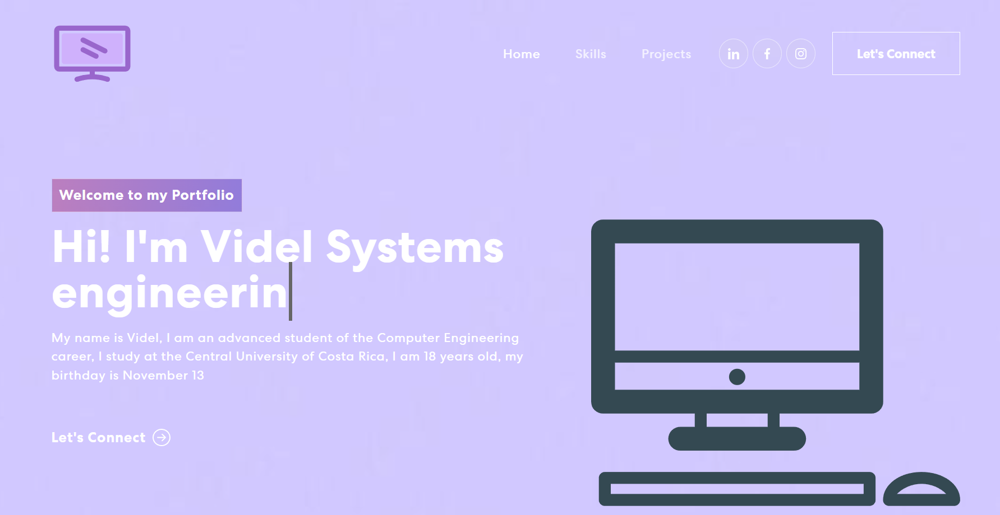

# portfolio project

This project consists of a personal portfolio, made in react, react-bootstrap and react-icon were also used

## To run this project you just need to do the following:

### `npm start`

This project is composed of 7 react components and they have styles from the App.css file\

## The finished page looks like this:

